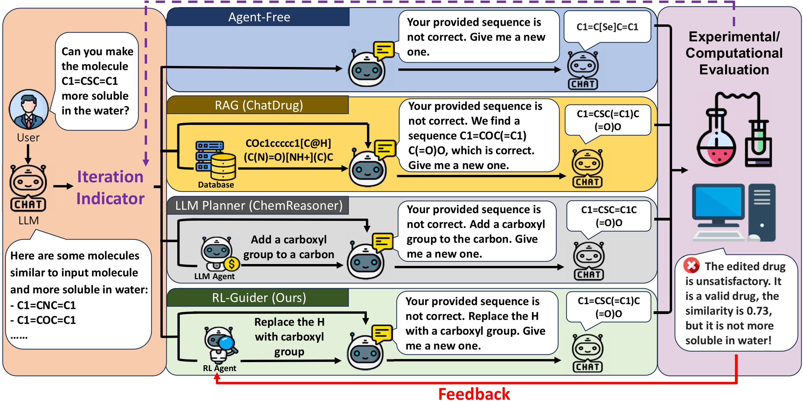

# 
 [ACL 2025] An LLM Agent for Molecular Optimization and Drug Pharmaceutical Improvement

---

>**RL-Guider: Leveraging Historical Decisions and Feedback for Drug Editing with Large Language Models**  

>[Xufeng Liu](https://xufliu.github.io/)* , [Yixuan Ding]()*† , [Jingxiang Qu](https://tom-q.netlify.app/), [Yichi Zhang](), [Wenhan Gao](https://wenhangao21.github.io/)‡ , [Yi Liu](https://jacoblau0513.github.io/)‡   
>\* Equal contribution.  
>† Work done during an internship at Stony Brook University.  
>‡ Equal senior contribution.   
>ACL 2025  

> **Introduction:** Recent success of large language models (LLMs) in diverse domains showcases their potential to revolutionize scientific fields, including drug editing. Traditional drug editing relies on iterative conversations with domain experts, refining the drug until the desired property is achieved. This interactive and iterative process mirrors the strengths of LLMs, making them well-suited for drug editing. *In existing works, LLMs edit each molecule independently without leveraging knowledge from past edits.* 
However, human experts develop intuition about effective modifications over time through historical experience; accumulating past knowledge is pivotal for human experts, and so it is for LLMs. *In this work, we propose RL-Guider — a reinforcement-learning agent to provide suggestions to LLMs; it uses the rich information provided from evaluating editing results made by the LLM based on the recommendations to improve itself over time.* 
**RL-Guider** is the first work that leverages both the comprehensive **"world-level"** knowledge of LLMs and the knowledge accumulated from historical feedback. As a result, RL-Guider mitigates several shortcomings of existing approaches and demonstrates superior performance.

## Framework

   

## Environment
[Requirements.txt](requirements.txt)

## Running

